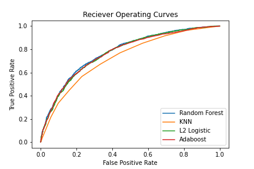

# Rain HW

## WHAT IS THIS
A homework assignment from my ML class!
We had to use the `seattle_rain_train.csv` to train a model to predict whether it would rain the next day.
We used `seattle_rain_test.csv` to output predictions. We submitted the `submission.csv` to Kaggle as a part of
the class competition. The work is in the `notebook.ipynb`, there are cool ROC curves in there!

